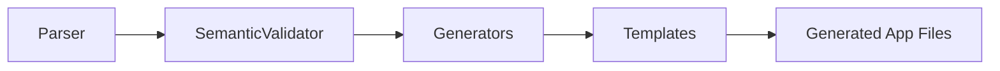

# API / Reference

This page maps core framework packages and responsibilities.

| Package | Purpose |
|---|---|
| `@vasp-framework/core` | AST types, constants, shared errors |
| `@vasp-framework/parser` | Lexer, parser, semantic validator |
| `@vasp-framework/generator` | Generator pipeline and template rendering |
| `@vasp-framework/runtime` | Frontend composables and HTTP client integration |
| `vasp-cli` | End-user CLI commands |
| `@vasp-framework/language-server` | Diagnostics, completions, hover, go-to-definition |
| `vasp-vscode` | VS Code extension client + syntax tooling |

## Generation pipeline

