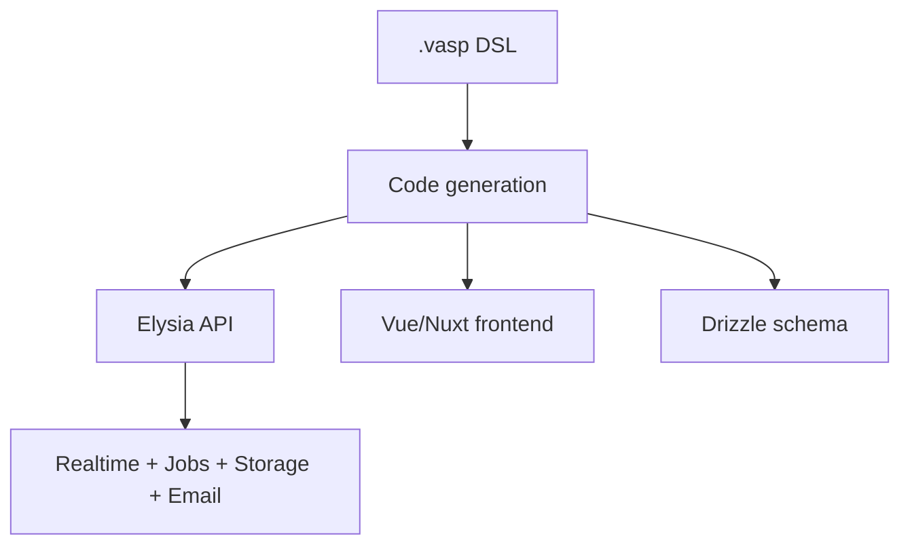

# Features Overview

Vasp includes a broad set of production-focused capabilities.

## Platform highlights

- Declarative DSL with semantic validation
- Elysia backend generation
- Drizzle schema generation
- Vue 3 SPA or Nuxt 4 SSR/SSG frontend
- Auth and RBAC
- CRUD and typed runtime client
- Realtime channels
- Background jobs across multiple executors
- Storage, email, cache, webhooks
- Observability and operational helpers
- Language server + VS Code extension

