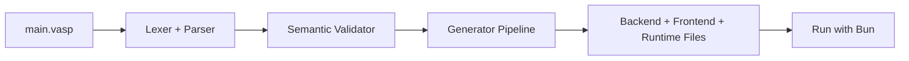

## Quick Start

```bash
# Install the CLI
bun install -g vasp-cli

# Create a project (interactive)
vasp new my-app

# Or use flags
vasp new my-app --typescript --ssr

cd my-app
vasp start
```

## How Vasp Works



::: tip
This docs site is organized for both first-time users and advanced teams. Start with **Guide**, then move to **DSL**, **CLI**, and **Features**.
:::
